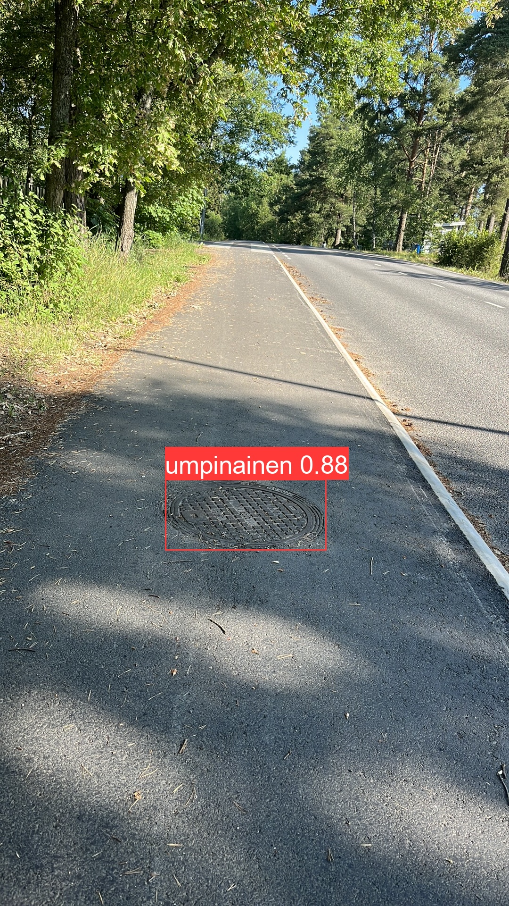
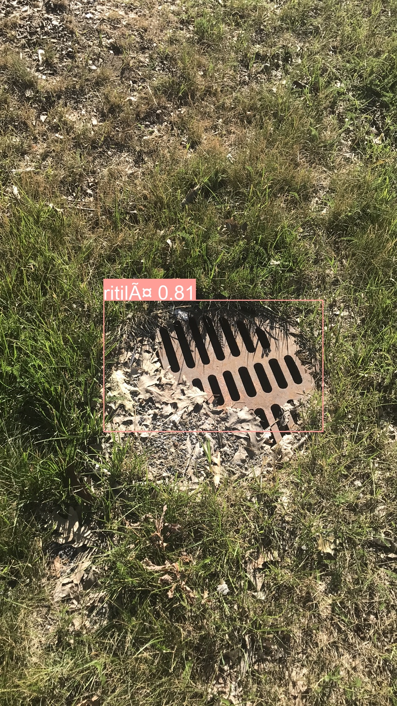

# Kaivon kansien tunnistaminen YOLOv5:llä

Tämä projekti oli toimeksianto Crowdsorsalle, ja kuvadata on heidän.

Alla ovat vaiheittaiset ohjeet YOLOv5-mallin asentamiseen, kouluttamiseen ja käyttämiseen kaivojen kansien havaitsemiseksi kuvista. Projektissa käytettiin noin 10000 .jpg-kuvaa, jotka on tallennettu kansioon data/kuvat. 

<p float="left">
  
   
</p>

### Tiedostot ajetaan järjestyksessä:
1. 1_yolov5_install.ipynb
2. 2_data_copy.ipynb
3. 3_yolo_training.ipynb
4. 4_detect.ipynb

## Testaus
Testaus tapahtuu tiedostossa code/ipywidgets.ipynb.


# 1_yolov5_install.ipynb - YOLOv5 Asennusohjeet  
Tämä osio sisältää tarvittavat vaiheet YOLOv5-repositorion kloonaamiseksi ja vaadittujen riippuvuuksien asentamiseksi.

### Vaatimukset
Varmista, että sinulla on asennettuna seuraavat ohjelmistot:

- Python 3.10 tai uudempi
- Git

### Asennus
**1. Kloonaa YOLOv5-repositorio**

Avaa terminaali tai komentokehote ja suorita seuraava komento kloonataksesi YOLOv5-repositorion:

```
 !git clone git@github.com:ultralytics/yolov5.git

```

# 2_data_copy.ipynb - Kuvien Siirtäminen Koulutusta Varten
Tämä skripti siirtää kuvatiedostot määritellyistä kansioista koulutusta ja validointia varten. Se käyttää os- ja shutil-moduuleja tiedostojen käsittelyyn.

### Kansion Rakenne
- data/kuvat: Kaikki kuvatiedostot (~10000 kuvaa) 
- train_data/images/train: Koulutuskuvien kansio
- train_data/images/val: Validointikuvien kansio

**Toiminta:**

1. **Lisää Kansio ja Kuvat:**
   - Luo kansio nimeltä `kuvat` hakemistoon `data`.
   - Lisää kansioon kuvatiedostot.
   - Varmista, että kuvatiedostot ovat oikeassa formaatissa (.jpg) ja että ne ovat nimetty oikein.

Tässä hakemistossa olevat kuvat ovat tärkeitä havainnointia ja koulutusta varten. Varmista, että kaikki tarvittavat kuvat ovat saatavilla ennen kuin jatkat YOLOv5-mallin käyttöä.

### Tiedostot
- data/train.txt: Lista koulutuskuvien nimistä
- data/val.txt: Lista validointikuvien nimistä

# 3_yolo_training.ipynb - YOLOv5 Koulutusohjeet
Tämä osio sisältää ohjeet YOLOv5-mallin kouluttamiseen omilla tiedoilla.

### Valmistelut
**1. Kopioi mukautettu tiedostosi YOLOv5:n data-kansioon:**

Kopioi custom_data.yaml YOLOv5:n data-kansioon:
```
!cp custom_data.yaml yolov5/data/
```

**2. Siirry YOLOv5-kansioon:**
```
cd yolov5
```
### Koulutuksen Suorittaminen
**1. Kouluta YOLOv5-malli mukautetuilla tiedoilla:**

Aja seuraava komento kouluttaaksesi YOLOv5-mallin omilla tiedoillasi. Huomaa, että batch-koko on asetettu arvoon 2, mutta voit muuttaa sen tarpeidesi mukaan. Suurempi batch-koko vaatii enemmän muistia, joten säädä sitä laitteistosi mukaisesti.
```
!python train.py --img 640 --batch 2 --epochs 100 --data custom_data.yaml --weights yolov5s.pt --cache
```

- --img 640: Kuvat, joiden koko on 640x640 pikseliä.
- --batch 2: Batch-koko asetettu kahteen. Voit säätää tätä arvoa oman laitteistosi mukaan.
- --epochs 100: Koulutuksen epochien määrä on 100.
- --data custom_data.yaml: Polku mukautettuun datatiedostoon.
- --weights yolov5s.pt: Käytettävät esikoulutetut painot.
- --cache: Tämä vaihtoehto lataa datan muistiin nopeuttaakseen koulutusta.

# 4_detect.ipynb - CSV-tiedoston Luominen Havainnoista YOLOv5-mallin Avulla

Tämä osio kuvaa, miten luodaan CSV-tiedosto havainnoista käyttämällä YOLOv5-mallia. Tämä prosessi antaa mahdollisuuden tallentaa havaintotiedot CSV-muodossa.

## Havainnointi

1. **Kopioidaan detect2.py YOLOv5 kansioon**

    Aluksi kopioidaan detect2.py kansiossa csv-tiedostoluonti kansioon yolov5
   
2. **Tarkista YOLOv5-mallin koulutus:**

   Varmista, että YOLOv5-malli on koulutettu ja että parhaat painot (`best.pt`) on tallennettu polkuun `yolov5/runs/train/exp(N)/weights/best.pt`, missä `exp(N)` on käytetyn koulutuskokeilun numero.

3. **Suorita Havainnointi:**

   Käytä seuraavaa komentoa suorittaaksesi havainnoinnin ja tallentaaksesi tulokset CSV-tiedostoon:
   ```bash
   !python yolov5/detect2.py --weights yolov5/runs/train/exp2/weights/best.pt --img 640 --conf 0.50 --source data/kuvat --save-csv

- --weights runs/train/exp(N)/weights/best.pt: Polku parhaisiin koulutuspainoihin. Vaihda exp(N) vastaamaan käytettyä koulutuskokeilua.
- --img 640: Kuvien koko, tässä tapauksessa 640x640 pikseliä.
- --conf 0.50: Havainnointien varmuuskynnys. Tässä käytetään arvoa 0.50.
- --source ../data/kuvat: Polku kansiosta, jossa kuvat sijaitsevat.
- --save-csv: Tämä vaihtoehto tallentaa havaintojen tiedot CSV-tiedostoon.


# code/ipywidgetz.ipynb - Kuvantunnistus ipywidgetseillä 


Tämä osio kuvaa kuvantunnistussovelluksen, joka käyttää ipywidgets-pakettia interaktiivisen käyttöliittymän luomiseen.

## Tunnistussovelluksen Toiminta

Tämä sovellus havaitsee kuvissa kohteita käyttämällä YOLOv5-mallia ja ipywidgets-pakettia interaktiivisen käyttöliittymän luomiseen. Sovelluksessa voit valita kuvan indeksin syöttämällä sen tekstikenttään ja painamalla "detect"-painiketta.

Kun "detect"-painiketta painetaan, sovellus suorittaa seuraavat vaiheet:
1. Valitsee kuvan, jonka indeksi on syötetty tekstikenttään.
2. Käyttää YOLOv5-mallia tunnistamaan kohteet valitussa kuvassa.
3. Näyttää tunnistetut kohteet kuvassa.
4. Tallentaa tunnistetun kuvan `../images/exp/`-kansioon.

## Vaatimukset

- Python 3.10 tai uudempi
- ipywidgets-paketti

## Asennus

Asenna ipywidgets-paketti pipillä komennolla:

```bash
pip install ipywidgets
```
# csv-tiedostonluonti/kartta_plot.ipynb - Kartoitetut Kuvat ja Tunnistukset
kartta_plot.ipynb tiedostolla voi luoda kartan, joka näyttää kuvat tunnistuksilla käyttäen Folium-kirjastoa Pythonissa.

## Vaatimukset
- Python 3.10 tai uudempi
- Seuraavat Python-kirjastot:
    - pandas
    - folium
    - ast
    - pillow
Voit asentaa tarvittavat kirjastot seuraavilla komennoilla:
```bash
pip install pandas folium pillow
```

## CSV-tiedoston Rakenne
CSV-tiedoston updated_predictions.csv tulisi sisältää seuraavat sarakkeet:

- Latitude: Kuvan sijainnin leveysaste DMS-muodossa (Degrees, Minutes, Seconds)
- Longitude: Kuvan sijainnin pituusaste DMS-muodossa (Degrees, Minutes, Seconds)
- Image Name: Kuvan nimi
- Prediction: Tunnistuksen tulos

# csv-tiedostonluonti/csc-tiedostonluonti.ipynb - Kuvantunnistus ja Metadatan Päivitys CSV-tiedostoon
csc-tiedostonluonti.ipynb Python-skriptillä voi käsitellä kuvien metatietoja ja päivittää niitä CSV-tiedostoon. Skripti lukee kuvien GPS-koordinaatit ja lisää ne vastaaviin riveihin CSV-tiedostossa.

## Vaatimukset
- Python 3.10 tai uudempi
- Seuraavat Python-kirjastot:
    - pandas
    - pillow
    
Voit asentaa tarvittavat kirjastot seuraavalla komennolla:
```bash
pip install pandas pillow
```

# csv-tiedostonluonti/Tuloksia.ipynb - Kuvantunnistus ja Analysointi
Tuloksia.ipynb tiedostossa analysoidaan ja visualisoidaan YOLOv5-mallin tuottamia ennusteita sekä kuvia ja niiden metatietoja Pythonin ja erilaisten kirjastojen avulla.

## Asennus
Varmista, että seuraavat Python-kirjastot on asennettu:

- pandas
- pillow
- matplotlib
- seaborn
- ipywidgets

Voit asentaa ne pip-komennolla:

```bash
pip install pandas pillow matplotlib seaborn ipywidgets
```

